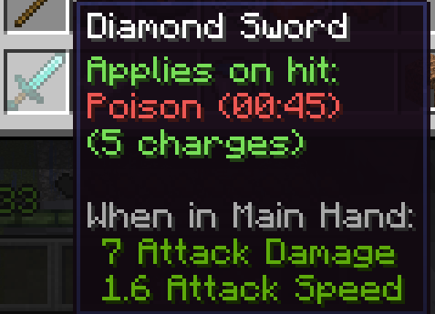
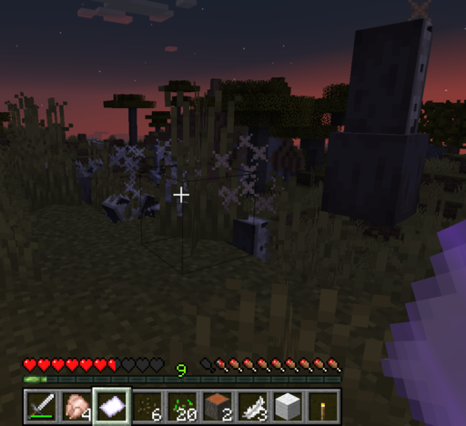

# 

This mod adds **brand new game mechanics** to make Minecraft feel more ✨magical✨. Works in single player and fully
server side with vanilla or Fabric clients supported. Created for
[NeoForge's 2025 Serverside Summer](https://neoforged.net/news/2025serversidesummer/).

# Brewing

You can now **brew potions in cauldrons** instead of a brewing stand. Just place one above a soul fire or campfire and
right click to put in the ingredients. When you're done right click with a bottle to take them out.

All vanilla potions work with the same recipe as before, with one change - instead of the Turtle Master ones nobody
uses, **wither potions** are now a thing on Java. You can brew the basic one with nether wart and a **wither rose**, and
the splash or lingering versions with gunpowder and dragon's breath.

# Dipping

Ever wanted to dip your blade in poison and beat a monster Witcher-style? Now you can! Brew a potion of **poison,
weakness or slowness** in a cauldron and right click it with a **sword or axe** while sneaking. The next five hits with
that weapon will apply that effect to the unfortunate victim.

Other recipes can transform the item, like **poisoning a potato** or turning sweet berries into **glow berries** with a
night vision potion.

# Spells

We all know you can shoot fire charges from a dispenser, but what about your hands? **Fireball** lets you do that.
Spells are a **new type of item** you can cast by **right clicking** with one in your hand. Right now Immersive Magic
adds two of them:

* **Evoker Fangs** - spawns a line of 8 fangs in front of you like the evoker's long-range attack
* **Fireball** - shoots an explosive fireball that sets things on fire

I got more of them planned, so stay tuned for updates!

# Soul Binding

Ok, but how do you actually get spells? To get started craft an **empty scroll** with a piece of **paper** and an
**amethyst shard**. Equip it in your off hand and **kill a mob** to trap its soul in the scroll. This lets you
cast the mob's associated spell a limited amount of times. **Nothing happens** if the mob you killed doesn't have one.

You can also use **spells as a container** instead of crafting a new scroll every time.

* **Evoker** gives **Evoker Fangs**, obviously
* **Blaze** gives **Fireball**

Of course, there's a catch. Soul binding costs XP, the same amount you get from killing the mob. This means you get **no
XP reward** and you need to have at least that amount on your bar. Still worth it if you ask me.